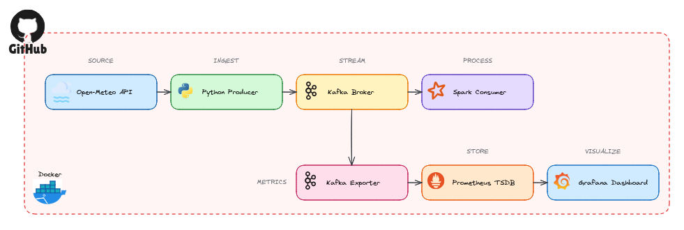
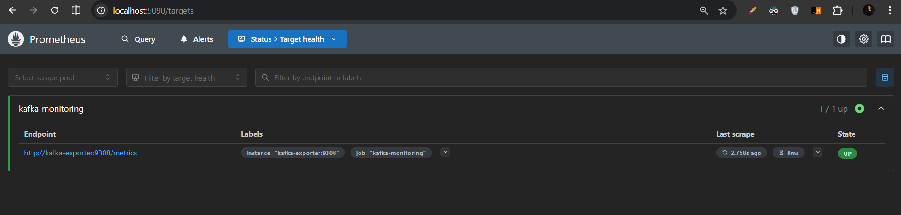
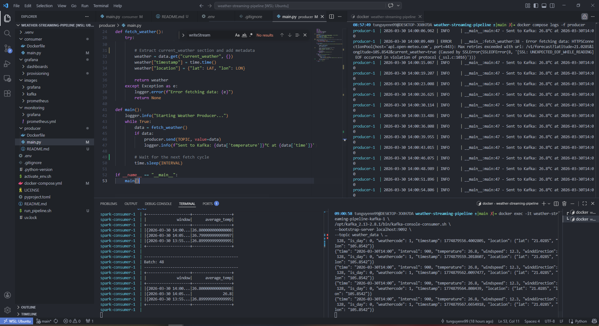
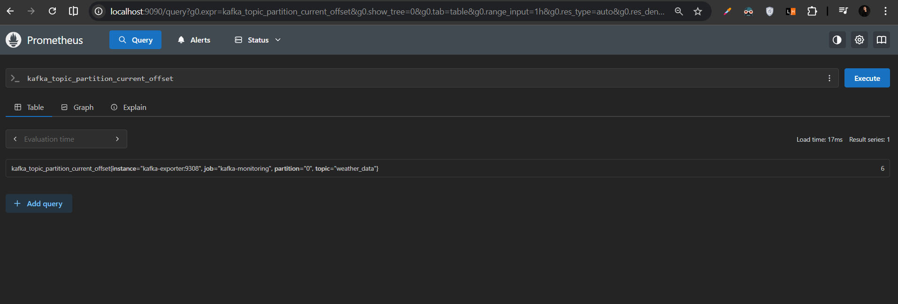
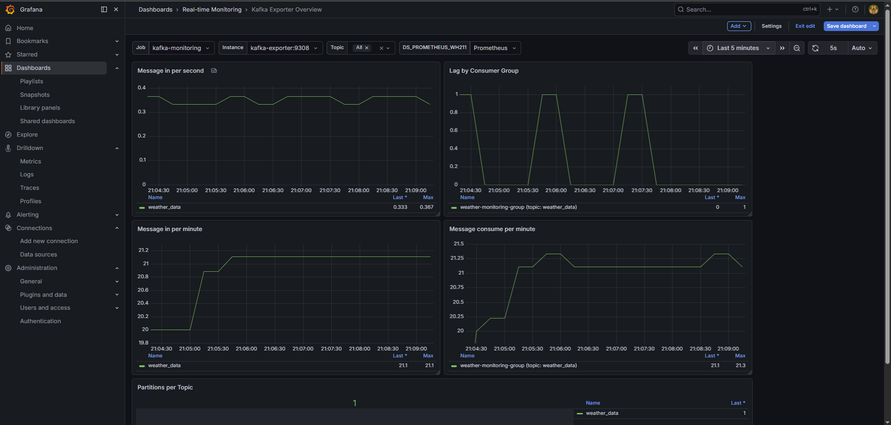

# 🌀 Real-Time Weather Data Streaming Pipeline

<p align="center">
  
  
  
</p>

<p align="center">
  
  
  
  
</p>

<p align="center">
  
  
  
</p>

A robust, end-to-end data engineering ecosystem for real-time weather analytics. This pipeline ingests live metrics from the **Open-Meteo API**, streams them through **Apache Kafka**, processes windowed aggregations with **PySpark**, and visualizes system performance via a **Prometheus & Grafana** monitoring stack.

-----

## 🏗️ System Architecture

The pipeline is built on a decoupled, event-driven architecture to ensure high availability and horizontal scalability:



1.  **Data Ingestion:** Fetches live weather metrics (Temperature, Wind speed, etc.) from the **Open-Meteo API**.
2.  **Producer (Python):** A high-performance ingestion script managed by **uv** that polls the API and publishes JSON payloads to Kafka.
3.  **Message Broker (Kafka & Zookeeper):** Orchestrates high-throughput data buffering and decoupling between ingestion and processing.
4.  **Consumer (PySpark):** Leverages **Spark Structured Streaming** to ingest Kafka streams, enforce strict schemas, and calculate real-time windowed averages.
5.  **Monitoring Stack:**
      * **Kafka Exporter:** Scrapes internal Kafka metrics (offsets, partitions, broker info).
      * **Prometheus:** Serves as the time-series database for all system-level metrics.
      * **Grafana:** Provides real-time visualization of Kafka throughput and processing trends.

-----

## 🛠️ Tech Stack

  * **Language:** Python 3.11+ (Environment managed by **uv**)
  * **Streaming:** Apache Kafka, Zookeeper
  * **Processing:** Apache Spark (PySpark Structured Streaming)
  * **Monitoring:** Prometheus, Grafana, Kafka Exporter
  * **Infrastructure:** Docker, Docker Compose

-----

## 📂 Project Structure

```bash
.
├── producer/               # Python Producer (API -> Kafka)
│   ├── main.py             # Fetching & Publishing logic
│   └── Dockerfile
├── consumer/               # PySpark Consumer (Kafka -> Processing)
│   ├── main.py             # Structured Streaming & Aggregation logic
│   └── Dockerfile          # Spark image with Kafka connectors
├── monitoring/             # Monitoring Configuration
│   └── prometheus.yml      # Scrape configs for Kafka Exporter
├── grafana/                # Visualization
│   ├── dashboards/         # Pre-configured JSON dashboard exports
│   └── provisioning/       # Automated DataSource & Provider setup
├── docker-compose.yml      # Full stack orchestration
├── run_pipeline.sh         # Master startup script with auto-cleanup
├── pyproject.toml          # Dependency management (uv)
└── README.md
```

-----

## 🚀 Quick Start

### 1\. Prerequisites

Ensure you have **Docker** and **Docker Compose** installed. For local development, **uv** is recommended for high-speed dependency resolution.

### 2\. Launch the Pipeline

Use the provided master script to handle environment cleanup (clearing old Spark checkpoints) and service orchestration:

```bash
chmod +x run_pipeline.sh
./run_pipeline.sh
```

### 3\. Verify Operations

  * **Spark Aggregations:** Monitor real-time windowed outputs in your terminal:
    ```bash
    docker compose logs -f spark-consumer
    ```
  * **Kafka Health:** Verify topic health and data offsets:
    ```bash
    docker exec -it kafka /opt/kafka/bin/kafka-topics.sh --bootstrap-server localhost:9092 --describe --topic weather_data
    ```

-----

## 📈 Monitoring & Visuals

The project includes a pre-configured Grafana dashboard that provides visibility into every stage of the pipeline:

### Kafka Performance Tracking
Monitor internal Kafka metrics such as broker status, message offsets, and partition distribution.


### Data Ingestion Verification
Validate that the Python Producer is successfully fetching API data and sending JSON payloads to the Kafka broker.


### Prometheus Metric Exploration
Verify that the Kafka Exporter is being correctly scraped and check the raw time-series data for your topics.


### End-to-End Dashboard
The final Grafana dashboard integrates all components for a holistic view of the system's health and data throughput.


---

### 💡 Visual Setup Guide
If you are setting this up for the first time, you can refer to the step-by-step connection guides in the `images/grafana/` folder:
1. **Initialize Connection:** `01_connect_init.png`
2. **Connect Prometheus:** `02_connect_prometheus.png`
3. **Template Setup:** `05_kafka_exporter_template.png` (using ID 7589)

---

### 🤝 Connect & Community

* **Author**: [Tu Nguyen](https://www.linkedin.com/in/tunguyenn99/)
* **Community**: Join the [Xom Data](https://www.facebook.com/groups/xomdata/) community for more data analytics engineering insights!

*Built with ❤️ for the **Xom Data** community.*